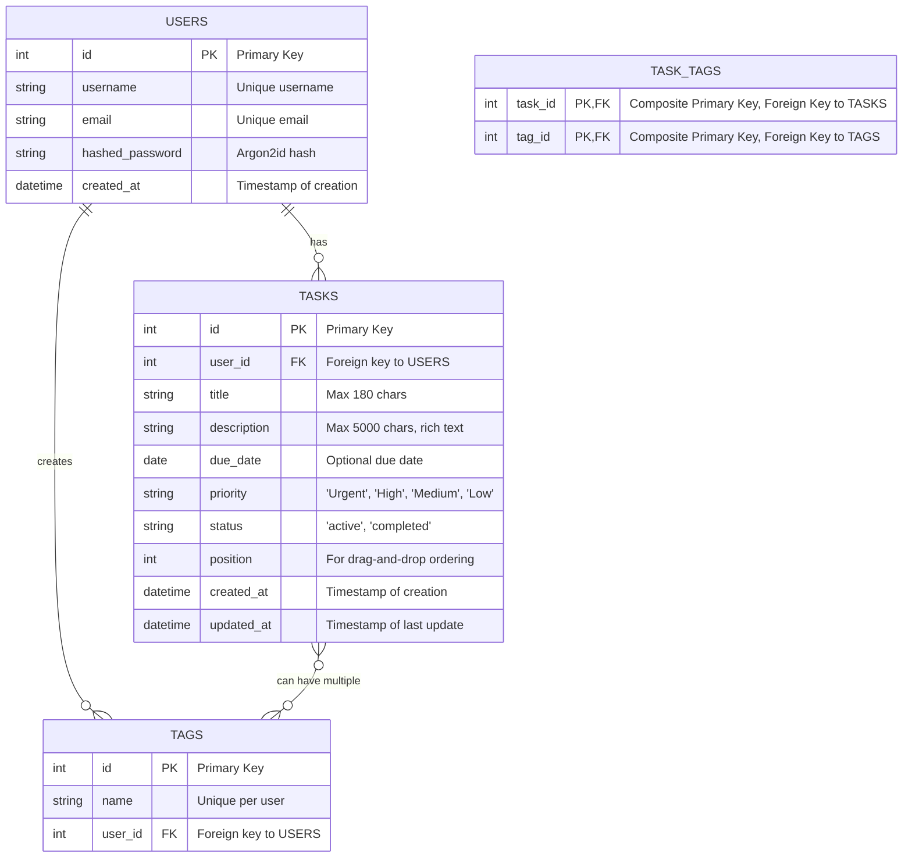

# Data Model

This document defines the data entities for the application, based on the feature specification and implementation plan.

## Entity Relationship Diagram (ERD)

## Table Definitions

### `users`

Stores user account information.

| Column | Type | Constraints | Description |
| :--- | :--- | :--- | :--- |
| `id` | SERIAL | PRIMARY KEY | Unique identifier for the user. |
| `username` | VARCHAR(50) | NOT NULL, UNIQUE | User's chosen username. |
| `email` | VARCHAR(255) | NOT NULL, UNIQUE | User's email address, used for login. |
| `hashed_password` | VARCHAR(255) | NOT NULL | Password hash (using Argon2id). |
| `created_at` | TIMESTAMPTZ | NOT NULL, DEFAULT NOW() | Timestamp when the user was created. |

### `tasks`

Stores the individual to-do items for each user.

| Column | Type | Constraints | Description |
| :--- | :--- | :--- | :--- |
| `id` | SERIAL | PRIMARY KEY | Unique identifier for the task. |
| `user_id` | INTEGER | NOT NULL, REFERENCES users(id) ON DELETE CASCADE | The user who owns the task. |
| `title` | VARCHAR(180) | NOT NULL | The title of the task. |
| `description` | TEXT | | A detailed description (up to 5000 chars). |
| `due_date` | DATE | | An optional due date for the task. |
| `priority` | VARCHAR(10) | NOT NULL, DEFAULT 'Medium' | Priority level ('Urgent', 'High', 'Medium', 'Low'). |
| `status` | VARCHAR(10) | NOT NULL, DEFAULT 'active' | Current status ('active', 'completed'). |
| `position` | INTEGER | NOT NULL | An integer for manual ordering by the user. |
| `created_at` | TIMESTAMPTZ | NOT NULL, DEFAULT NOW() | Timestamp when the task was created. |
| `updated_at` | TIMESTAMPTZ | NOT NULL, DEFAULT NOW() | Timestamp of the last update. |
| `search_vector` | TSVECTOR | | GIN indexed vector for full-text search. |

**Indexes**:
- A GIN index will be created on the `search_vector` column to enable fast full-text search.
- Index on `user_id` and `due_date`.
- Index on `user_id` and `priority`.

### `tags`

Stores user-defined tags for organizing tasks.

| Column | Type | Constraints | Description |
| :--- | :--- | :--- | :--- |
| `id` | SERIAL | PRIMARY KEY | Unique identifier for the tag. |
| `user_id` | INTEGER | NOT NULL, REFERENCES users(id) ON DELETE CASCADE | The user who owns the tag. |
| `name` | VARCHAR(50) | NOT NULL | The name of the tag. |

**Constraints**:
- A composite unique constraint on `(user_id, name)` to ensure tags are unique per user.

### `task_tags` (Many-to-Many Join Table)

Links tasks with their associated tags.

| Column | Type | Constraints | Description |
| :--- | :--- | :--- | :--- |
| `task_id` | INTEGER | PRIMARY KEY, REFERENCES tasks(id) ON DELETE CASCADE | Foreign key to the `tasks` table. |
| `tag_id` | INTEGER | PRIMARY KEY, REFERENCES tags(id) ON DELETE CASCADE | Foreign key to the `tags` table. |
